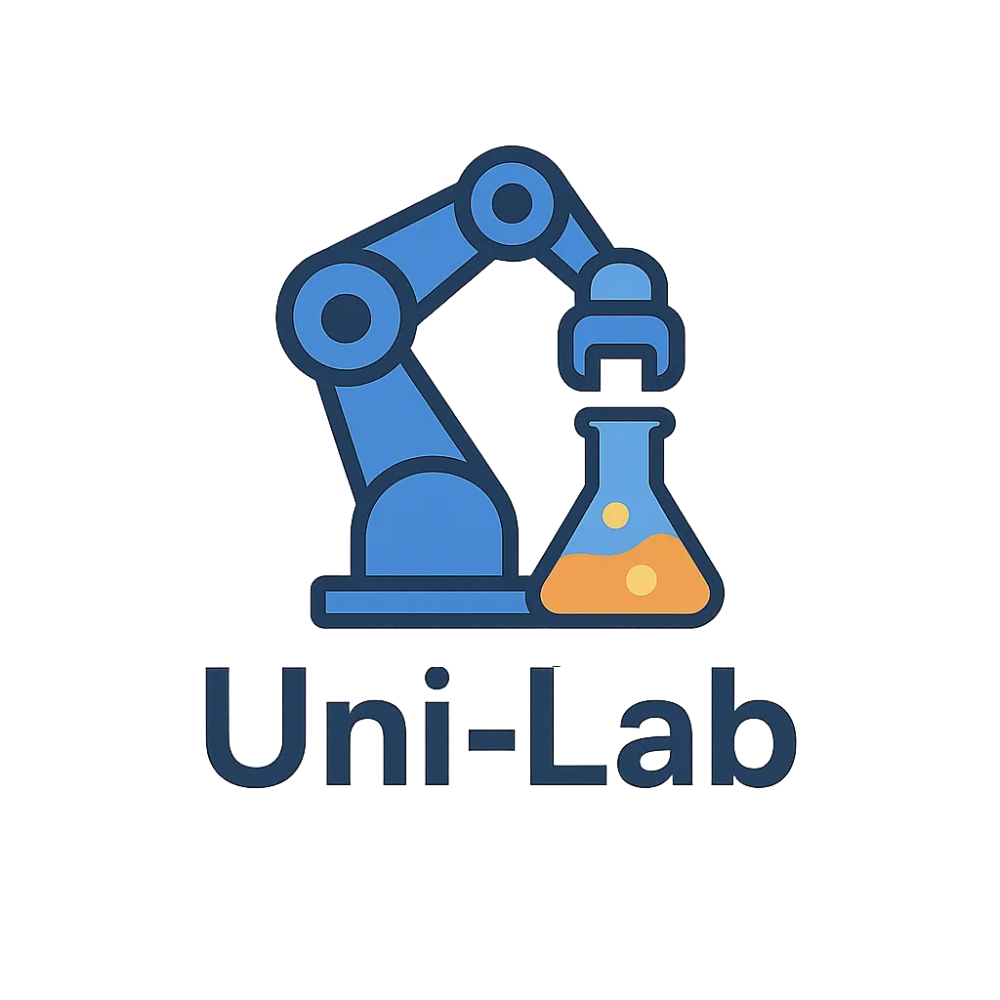

<div align="center">
  
</div>

# Uni-Lab-OS

<!-- Language switcher -->

[English](README.md) | **中文**

[](https://github.com/deepmodeling/Uni-Lab-OS/stargazers)
[](https://github.com/deepmodeling/Uni-Lab-OS/network/members)
[](https://github.com/deepmodeling/Uni-Lab-OS/issues)
[](https://github.com/deepmodeling/Uni-Lab-OS/blob/main/LICENSE)

Uni-Lab-OS 是一个用于实验室自动化的综合平台，旨在连接和控制各种实验设备，实现实验流程的自动化和标准化。

## 核心特点

- 多设备集成管理
- 自动化实验流程
- 云端连接能力
- 灵活的配置系统
- 支持多种实验协议

## 文档

详细文档可在以下位置找到:

- [在线文档](https://deepmodeling.github.io/Uni-Lab-OS/)

## 快速开始

### 1. 配置 Conda 环境

Uni-Lab-OS 建议使用 `mamba` 管理环境。根据您的需求选择合适的安装包：

| 安装包 | 适用场景 | 包含内容 |
|--------|----------|----------|
| `unilabos` | **推荐大多数用户** | 完整安装包，开箱即用 |
| `unilabos-env` | 开发者（可编辑安装） | 仅环境依赖，通过 pip 安装 unilabos |
| `unilabos-full` | 仿真/可视化 | unilabos + ROS2 桌面版 + Gazebo + MoveIt |

```bash
# 创建新环境
mamba create -n unilab python=3.11.14
mamba activate unilab

# 方案 A：标准安装（推荐大多数用户）
mamba install uni-lab::unilabos -c robostack-staging -c conda-forge

# 方案 B：开发者环境（可编辑模式开发）
mamba install uni-lab::unilabos-env -c robostack-staging -c conda-forge
# 然后安装 unilabos 和依赖：
git clone https://github.com/deepmodeling/Uni-Lab-OS.git && cd Uni-Lab-OS
pip install -e .
uv pip install -r unilabos/utils/requirements.txt

# 方案 C：完整安装（仿真/可视化）
mamba install uni-lab::unilabos-full -c robostack-staging -c conda-forge
```

**如何选择？**
- **unilabos**：标准安装，适用于生产部署和日常使用（推荐）
- **unilabos-env**：开发者使用，支持 `pip install -e .` 可编辑模式，可修改源代码
- **unilabos-full**：需要仿真（Gazebo）、可视化（rviz2）或 Jupyter Notebook

### 2. 克隆仓库（可选，供开发者使用）

```bash
# 克隆仓库（仅开发或查看示例时需要）
git clone https://github.com/deepmodeling/Uni-Lab-OS.git
cd Uni-Lab-OS
```

3. 启动 Uni-Lab 系统

请见[文档-启动样例](https://deepmodeling.github.io/Uni-Lab-OS/boot_examples/index.html)

4. 最佳实践

请见[最佳实践指南](https://deepmodeling.github.io/Uni-Lab-OS/user_guide/best_practice.html)

## 消息格式

Uni-Lab-OS 使用预构建的 `unilabos_msgs` 进行系统通信。您可以在 [GitHub Releases](https://github.com/deepmodeling/Uni-Lab-OS/releases) 页面找到已构建的版本。

## 引用

如果您在学术研究中使用 [Uni-Lab-OS](https://arxiv.org/abs/2512.21766)，请引用：

```bibtex
@article{gao2025unilabos,
    title = {UniLabOS: An AI-Native Operating System for Autonomous Laboratories},
    doi = {10.48550/arXiv.2512.21766},
    publisher = {arXiv},
    author = {Gao, Jing and Chang, Junhan and Que, Haohui and Xiong, Yanfei and
              Zhang, Shixiang and Qi, Xianwei and Liu, Zhen and Wang, Jun-Jie and
              Ding, Qianjun and Li, Xinyu and Pan, Ziwei and Xie, Qiming and
              Yan, Zhuang and Yan, Junchi and Zhang, Linfeng},
    year = {2025}
}
```

## 许可证

本项目采用双许可证结构：

- **主框架**：GPL-3.0 - 详见 [LICENSE](LICENSE)
- **设备驱动** (`unilabos/devices/`)：深势科技专有许可证

完整许可证说明请参阅 [NOTICE](NOTICE)。

## 项目统计

### Stars 趋势

<a href="https://star-history.com/#dptech-corp/Uni-Lab-OS&Date">
  
</a>

## 联系我们

- GitHub Issues: [https://github.com/deepmodeling/Uni-Lab-OS/issues](https://github.com/deepmodeling/Uni-Lab-OS/issues)

## SZLab Task 调度联调（独立模拟器）

完整接口和安全语义见 [`task-orchestration/README.md`](task-orchestration/README.md)。
每个服务使用独立终端，已经运行的服务可以直接复用，不要重复启动。Task API 终端进入
`task-orchestration`，使其 workspace root 能找到同目录下的示例 sidecar；其余命令从
仓库根目录执行。

1. 在项目规定的 Python 3.11 `mamba` 环境中启动 Task API：

```bash
cd task-orchestration
PYTHONPATH=src python -m uvicorn task_orchestration.main:app \
  --host 127.0.0.1 \
  --port 8091
```

1. 启动带 SZLab preset 的 `workflow_ui`：

```bash
PYTHONPATH=. python -m scripts.workflow_ui \
  --host 127.0.0.1 \
  --port 8014 \
  --preset szlab_robot_action_workflow \
  --no-browser
```

1. 启动 Vite：

```bash
npm --prefix unilabos_local_ui run dev
```

打开 `http://127.0.0.1:5174/` 后按以下顺序操作：

1. 在流程画布进入 Task 模板编辑，框选节点后右键“设为 Task 模板”。系统不会按
   SZLab 工位或工艺自动切分模板；新模板的 `resources`、输入条件和输出条件默认均为空，
   创建模板不要求先连接 OPC。仓库 sidecar 已将 S07、S06 两个示例模板预排到 Resource
   Schedule；自建模板仍需拖入“待排模板”。只有这里的模板会用于生成样品任务和 OPC
   模拟配置；静态示例不预置样品实例，运行前仍须点击“生成样品任务”。
2. 点击“生成 OPC 模拟配置”。profile 根据已排模板所含 workflow 节点及其 Action
   `opc_variables` 生成，不依赖模板条件。先在“变量目录”逐项确认真实变量名、
   `direction`、`data_type`、`source` 和 PLC→PC 变量的 `initial_value`；同时核对
   `opc.url`、`poll_interval`（0.05–60 秒）和 `io_timeout`（0.1–60 秒），再逐节点补全
   `channel`、`trigger`、`on_trigger`、`on_complete`，以及可选的
   `reset_when`/`after_reset`。
3. “保存草稿”允许保留精确校验路径但不能启动；“校验并保存”生成
   `runnable`；“保存并下载”只会在 runnable 校验通过后下载。
4. 安全默认 URL 为仅本机可达的 `opc.tcp://127.0.0.1:4840`，可直接启动。任何不同
   URL（包括旧 Bohrium 地址）都会显示阻断式远程写确认，只有明确确认后网页才发送
   `allow_unsafe_url: true`。独立 CLI 使用非默认 URL 时同样必须显式传
   `--allow-unsafe-url`。
5. 在 Task OPC 连接中填写同一 URL 并连接。设置样品数，点击“生成样品任务”，再单独
   点击“运行调度”。观察 Task Queue/执行状态和模拟器 Recent logs。
6. 完成后点击“停止并恢复 OPC”，确认 `RESTORE=succeeded`。

“启动 OPC 模拟”和“运行调度”完全独立，任一操作都不会自动触发另一项，默认也不会
自动启动模拟器。运行调度按 `poll → advance → tick` 推进；“暂停派发”不取消已下发
动作，而是继续收割在途动作。

Task 调度只维护样品内前序关系并派发 Action，不读取 `Robot_Home`、
`Robot_任务允许写入` 等设备握手变量，也不按设备或工位添加 mutex；同一设备的多个
Action 请求可以并发进入设备 Action。设备是否可用、OPC 握手与必要的串行保护由各
Action 内部负责，独立 Action 的内部锁仍可使用。`Template.resources` 和
`dynamic_resource_leases` 仅为旧 sidecar/API 兼容字段，不参与调度；Resource Schedule
中的设备信息只用于展示，不代表设备占用。store 读取旧 sidecar 时会丢弃已废弃的单数
`Template.trigger`；契约内合法的 `input_triggers`/`output_triggers` 会保留为用户定义的
流程级条件，升级不会自动删除，可在模板编辑区手动清除。

模拟器只保证同机单实例互斥，跨主机禁止并发运行。停止恢复前的类型敏感值比较只是
best-effort 所有权检查，不能防止跨主机竞争或 ABA；普通停止超时不会强杀，后端退出
超时强制终止时会把恢复状态标记为 `uncertain`。

六节点 schema v2 可运行示例位于
`scripts/config/szlab_task_opc_simulator.json`；**JSON 生成规范**见
`docs/developer_guide/opc_simulator_profile_v2.md`（Task 页可点「查看生成规范」；
大模型输出 JSON 写入 `task-orchestration/configs/` 后在下拉框选择并打开配置工作台）。独立 CLI 不含 `--samples`，样品数只在
网页中设置。`source` 仅允许 `action_node`、`task_input`、`task_output`、`manual`。
CLI 省略
`--timeout` 或传 `--timeout 0` 时不会自动退出，将持续运行直到收到停止信号：

```bash
python -m scripts.szlab_task_opc_simulator \
  --config scripts/config/szlab_task_opc_simulator.json
```

开发验证请先激活项目 Python 3.11 环境：

```bash
mamba activate unilab
python -m pytest tests/szlab_poly_studio -q
python -m pytest task-orchestration/tests -q
npm --prefix unilabos_local_ui test
npm --prefix unilabos_local_ui run build
```

提交前请确认并一次性 stage 本次 Task 调度相关文件，避免只提交 index 中的旧版本。
