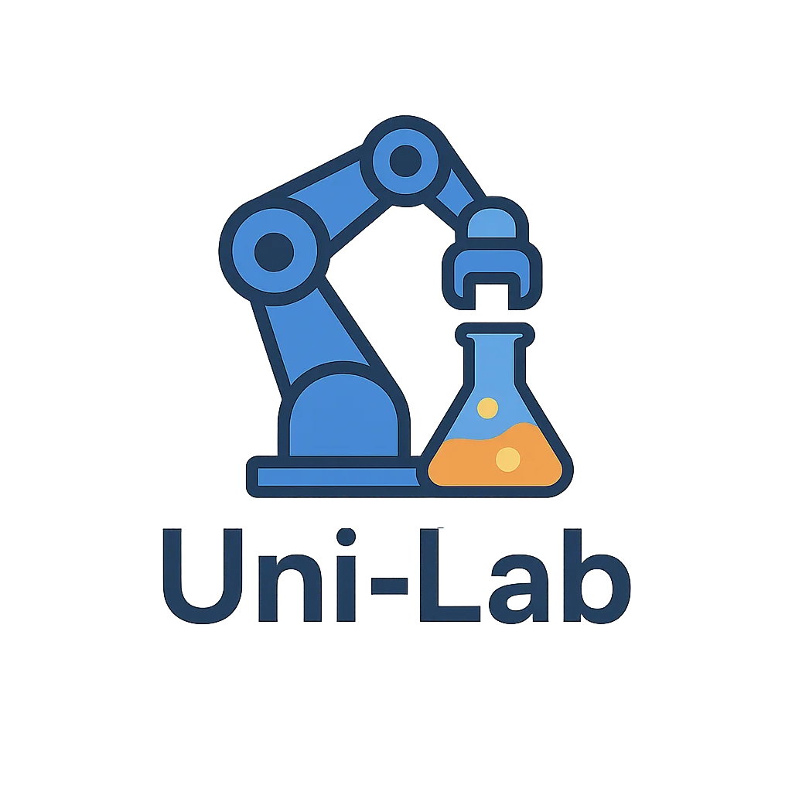

<div align="center">
  
</div>

# Uni-Lab-OS

<!-- Language switcher -->

[English](README.md) | **中文**

[](https://github.com/deepmodeling/Uni-Lab-OS/stargazers)
[](https://github.com/deepmodeling/Uni-Lab-OS/network/members)
[](https://github.com/deepmodeling/Uni-Lab-OS/issues)
[](https://github.com/deepmodeling/Uni-Lab-OS/blob/main/LICENSE)

Uni-Lab-OS 是一个用于实验室自动化的综合平台，旨在连接和控制各种实验设备，实现实验流程的自动化和标准化。

## 核心特点

- 多设备集成管理
- 自动化实验流程
- 云端连接能力
- 灵活的配置系统
- 支持多种实验协议

## 文档

详细文档可在以下位置找到:

- [在线文档](https://deepmodeling.github.io/Uni-Lab-OS/)

## 支持的运行时

默认安装和运行统一为 **Python 3.14 + NumPy 2 + HostLink，不需要 ROS**。
ROS 2 Jazzy/Humble 改为显式选装。普通 Python 驱动、Host/Slave、Workstation/
sub-device、物料、工作流、HTTP/WS API 和 MCP 都可以在无 ROS 环境运行。
MoveIt、RViz、ROS 原生驱动和图像管线仍需要相应 ROS 环境。

安装方式见[安装指南](docs/user_guide/installation.md)，能力边界见
[运行时与 ABI 基线](docs/user_guide/runtime_baseline.md)。

## 快速开始

### 1. 默认无 ROS 安装

源码安装（新 Conda 版本发布前也可使用）：

```bash
git clone -b dev https://github.com/deepmodeling/Uni-Lab-OS.git
cd Uni-Lab-OS
python -m venv .venv
# Linux/macOS: source .venv/bin/activate
# Windows PowerShell: .venv/Scripts/Activate.ps1
python scripts/dev_install.py
unilab --disable-browser
```

也可解压对应平台的配套 wheel 包，用 Python 3.14 执行 `python install_wheel_release.py`：
自动新建环境、离线安装全部默认依赖，并实际验证 Opentrons 96 孔板创建。
修正版 Opentrons 和固定 PLR wheel 随发行附件分发，不上传 PyPI；仅对公共源执行
`pip install unilabos` 找不到它们，需要安装入口或 `--find-links <配套包>/wheelhouse`。
上面的源码安装工具会先构建配套依赖。详见[安装指南](docs/user_guide/installation.md)。

**0.12.4+ 默认 Conda 包发布后**：

```bash
mamba create -n unilab --override-channels -c uni-lab -c conda-forge "unilabos>=0.12.4"
mamba activate unilab
unilab --disable-browser
```

旧 Conda 版本仍带 ROS；默认安装不添加任何 RoboStack channel。

| 安装包 | 用途 |
| --- | --- |
| `unilabos` | 默认应用及无 ROS 依赖 |
| `unilabos-ros2` | 显式选装 Jazzy/Humble 运行时和消息扩展 |
| `unilabos-full` | 完整运行环境、ROS 桌面、文档、测试与开发工具 |

需要 ROS 时，在独立环境安装对应的 `unilabos-ros2` 变体，并指定
`--backend ros2`，具体命令见安装指南。硬件专用 SDK 按设备包要求安装；
源码开发使用 `python scripts/dev_install.py --extras full`，一次安装文档、测试和开发依赖。
pip 只保留 `ros2` / `full` 两个可选档位；原生 ROS 仍由 Conda/RoboStack 安装。
`unilabos-env` 停止发布，默认依赖直接由 `unilabos` 声明。

### 2. 克隆仓库（可选，供开发者使用）

```bash
# 克隆仓库（仅开发或查看示例时需要）
git clone https://github.com/deepmodeling/Uni-Lab-OS.git
cd Uni-Lab-OS
```

### 3. 启动 Uni-Lab

默认启动微后端权威进程及受管 Host 子进程。权威进程提供管理/HTTP API
（默认 `8002`），Host 提供 HostLink TCP 通道（默认 `7302`）。默认 backend
下两个进程都不需要 ROS。

```bash
# HostLink 运行时（默认）
unilab -g path/to/graph.json --backend hostlink --port 8002 --hostlink-port 7302

# ROS 2 Jazzy 运行时（先激活包含 Jazzy 的 Conda 环境）
mamba activate unilab
unilab -g path/to/graph.json --backend ros2 --port 8002

# 只验证/导入注册表，不启动设备
unilab --check-mode --complete-registry --skip-env-check
```

需要拆分部署时，可以先单独启动调度/工作流权威进程，再让一个或多个 Edge
进程连接它：

```bash
# 终端 1：Backend 权威（不加载设备图，也不执行设备）
unilab --role backend --port 8081

# 终端 2：Edge 执行进程
unilab -g path/to/graph.json --backend hostlink \
  --address http://127.0.0.1:8081 --port 8002
```

省略 `-g` 时 Edge 可以以空图启动，之后通过驱动包或受管设备 API 添加设备。
Slave 仍需要自己的设备图，并使用 `--is-slave --host-node-ip <host>` 连接 Host。

### 4. 连接远端 Backend

连接远端 Backend 时，通过一个明确的 `--address` 指定地址；地址可以写服务根
地址，也可以直接写 `/api/v1` 根地址，实验室凭据通过 `--ak`、`--sk` 传入：

```bash
unilab -g path/to/graph.json --backend hostlink \
  --address https://backend.example.com/api/v1 \
  --ak "$AK" --sk "$SK"
```

Edge 对该地址只使用 `runtime.v1`：HTTP `/api/v1/*` 与 `/api/v1/ws/schedule`
控制 WebSocket 是同一个服务、同 host 同端口；调度、工作流、物料与注册表都由
Backend 权威承接。WebSocket 只传短通知，完整权威内容通过 HTTP 拉取。
`--role backend` 启动的正是这样一个权威。

对旧云端 Backend（`job_start` / `host_node_ready` 消息族、`/ws/schedule` 在
HTTP 端口 `+1`）的兼容不再由 Edge 自动选择：它收敛在
`unilabos.server.backend.legacy_adaptor.legacy`，由 Backend 侧显式装配
（`BackendSessionFactory.create_legacy_client()`、
`build_legacy_backend_websocket_url()`）。地址派生与 Edge 连接工厂都不再按
legacy 探测分叉。

### 5. 使用自定义界面

Uni-Lab 只提供 backend API，Edge 进程不托管 SPA。请单独构建或部署自己的
前端（[Uni-Lab FE 源码](https://git.dp.tech/lab-os/uni-lab-fe)），并把 API 根地址配置为管理端点：

| 部署方式 | 前端 API 根地址 |
|----------|----------------|
| 本地单进程 Edge | `http://127.0.0.1:8002` |
| 拆分部署 | `http://127.0.0.1:8081`（Backend 权威） |
| 远端 Backend | 启动参数 `--address` 指定的地址 |

前端在独立的 Uni-Lab FE 仓库维护，本仓库提供后端 API 和导出的接口契约。

接口契约见 `/api/openapi.json`，交互式文档见 `/api/docs`。以 Vite 为例，
自定义静态前端可独立开发和预览：

```bash
pnpm install
pnpm dev --host 0.0.0.0       # 开发服务器
pnpm build
python -m http.server 4173 --directory dist  # 简单本地预览
```

API base 的环境变量名称由前端框架自行决定；将它设置为上表地址，并通过
`/api/v1/...` 发起类型化 HTTP 请求。需要实时刷新时，浏览器前端可以使用
SSE/EventSource 做失效通知，再通过 HTTP 重新读取权威数据。这个浏览器通知通道
与 Backend↔Edge 的 `control.v1` WebSocket 是两回事；浏览器不要连接 HostLink
TCP 端口 `7302`。

外部设备包也可以从精确的 Git 提交安装，并在下一次进程重启后挂载：

```bash
unilab package install \
  "git+https://github.com/<org>/<device-package>.git@<commit-sha>"
```

### 6. 最佳实践

请见[最佳实践指南](https://deepmodeling.github.io/Uni-Lab-OS/user_guide/best_practice.html)

## 参考驱动实现

微后端设计理念、完整 HTTP API 目录、物料与工作流契约、实时通道及 Python/CLI/MCP 接入方式，
见[完整接口手册](docs/developer_guide/interfaces/index.md)。

我们提供了七个可直接运行的示例设备包，均作为独立 GitHub 仓库维护（由
[LabDeviceTemplate](https://github.com/Xuwznln/LabDeviceTemplate) fork 生成）。克隆任一仓库，用
`--devices <包目录> --external_devices_only` 加载，编写自己的驱动时可启动运行、对照学习：

| 示例仓库 | 演示要点 |
|----------|----------|
| [LabDeviceLanDemo](https://github.com/Xuwznln/LabDeviceLanDemo) | 跨设备 `@subscribe` 订阅 + `call_device_action` 远程调用的局域网闭环（hub/sub 双进程） |
| [LabDeviceWorkstationDemo](https://github.com/Xuwznln/LabDeviceWorkstationDemo) | `hardware_interface` 代理——同一工作站内多个子设备共享同一通信端点：共享串口（默认 IO 方法名）与 Modbus `extra_info`（按设备注入各自 `slave_id`） |
| [LabDeviceExceptionDemo](https://github.com/Xuwznln/LabDeviceExceptionDemo) | 全部经网页式工作流提交路径（`/api/v1/workflow-tasks` + `/api/v1/error-decisions`）演示异常传播：异常穿出动作边界后等待 `abort` / `operator_intervention` 决策；点对点 `call_device_action` 的异常作为工作流节点在调用侧捕获；业务级守卫返回；人工替换结果让任务以 `succeeded` 收尾 |
| [LabDeviceMaterialsDemo](https://github.com/Xuwznln/LabDeviceMaterialsDemo) | host/slave 双进程——`@device(available_sites=...)` 固定位点（声明 → 注册表模板 → 权威位点实例 → 占用流转）、`@resource` 物料配合 `materials.*` 门面跨 HostLink 做物料 CRUD、`SiteSlot` 动作参数（前端 Site 选择器 uuid 或 label 便捷形态）；出库装板并加液：全部经网页式 HTTP API——`POST /materials/instantiate` 按件登记两块板、`POST /materials/lots/inbound` 按量登记（故意不够的）水、`POST /workflows` + `PUT graph` 上传三节点图（`host_node/apply_deduct_resource` 带 `material` 需求、`mount_resource={"name": ...}` 只按名字引用台面 → 设备 `fill_well` 带 `lot` 需求 → 报告），提交后整任务预留失败 `plan_not_executable`（板与水都无预留痕迹、设备未被调用），补料再提交成功——板 `active → in_use` 跨进程挂到 slave 台面、lot 扣减、孔位内容物落权威 |
| [LabDeviceLockDemo](https://github.com/Xuwznln/LabDeviceLockDemo) | 用并发提交的工作流把调度器锁语义变成证据：`(device, action)` 动作锁让两次 `occupy` 按提交顺序串行（第二个在 `/api/v1/scheduler/resources` 里 `waiting` 且 `blockers` 非空）、`@action(always_free=True)` 让同一动作的两次 `peek` 重叠、`materials_need_lock=["plate"]` 按权威板 uuid 互斥（两台设备处理同一块板串行，一台设备处理两块板并行）；`lock_auditor` 节点读探针账本核对，任一结论不成立即任务失败 |
| [LabDeviceInventoryDemo](https://github.com/Xuwznln/LabDeviceInventoryDemo) | 用工作流走通按数量计量的库存：注册表 `@resource` 试剂模板、`restock` 即网页"添加试剂"的 `POST /api/v1/materials/lots/inbound`（固定 lot 入库 100 ml）、`dispense` 步骤的 `inventory=[...]` 需求在任务启动时 all-or-nothing 预留、动作开始前扣减（设备回报扣减后的 lot `60 / 60 / 0`）、500 ml 需求在预留阶段被拒——任务 `failed` / `plan_not_executable`（`short by 440 ml`）、节点 `canceled`、设备不被调用、库存不变 |
| [LabDeviceComplexWorkflowDemo](https://github.com/Xuwznln/LabDeviceComplexWorkflowDemo) | 工作流的**运行时控制流**——循环容器由调度器逐轮执行（每轮是循环体节点的一个新 attempt，`trigger=loop_iteration`）：`with ctx.loop_for(3)` 固定轮数、参数里 `{{loop.iteration}}` 生成样品编号；`ctx.loop_while(ctx.device_state("reactor", "temperature_c", "<", 80))` 空循环体按间隔轮询设备状态字段（设备后台升温，"等到某状态"）；`ctx.loop_while(ctx.step_output("取样检测", "ready", "==", False))` 条件引用循环体里的检测步骤（"重复直到达标"）；两层 `for` 板 × 孔嵌套；最后一条把三种循环串成一条流程，「汇总报告」一次验证全部结果 |

每个示例都用 `unilab -g` 按图启动设备，再经管理 HTTP API 运行工作流：包里 `@workflow` 声明的是
**工作流模板**（随注册表上报，`GET /api/v1/registry/workflow-templates`），先经
`POST /api/v1/workflows/from-template` 把角色绑到设备实例化成工作流，再 `POST /api/v1/workflow-tasks`；
仓库 README 附带分步启动教程与实测输出，并自带可终止的双运行时 smoke
（`python -m <包名>.smoke --backend hostlink|ros2`）。这七个示例同时在主仓库 CI 中端到端验证。
底层的通信共享机制见
[最佳实践指南 §11.5](https://deepmodeling.github.io/Uni-Lab-OS/user_guide/best_practice.html)；
从零编写新驱动见[添加设备](https://deepmodeling.github.io/Uni-Lab-OS/developer_guide/add_device.html)。

## 消息格式

Uni-Lab-OS 使用预构建的 `unilabos_msgs` 进行系统通信。您可以在 [GitHub Releases](https://github.com/deepmodeling/Uni-Lab-OS/releases) 页面找到已构建的版本。

## 引用

如果您在学术研究中使用 [Uni-Lab-OS](https://arxiv.org/abs/2512.21766)，请引用：

```bibtex
@article{gao2025unilabos,
    title = {UniLabOS: An AI-Native Operating System for Autonomous Laboratories},
    doi = {10.48550/arXiv.2512.21766},
    publisher = {arXiv},
    author = {Gao, Jing and Chang, Junhan and Que, Haohui and Xiong, Yanfei and
              Zhang, Shixiang and Qi, Xianwei and Liu, Zhen and Wang, Jun-Jie and
              Ding, Qianjun and Li, Xinyu and Pan, Ziwei and Xie, Qiming and
              Yan, Zhuang and Yan, Junchi and Zhang, Linfeng},
    year = {2025}
}
```

## 许可证

本项目采用双许可证结构：

- **主框架**：GPL-3.0 - 详见 [LICENSE](LICENSE)
- **内置设备代码** (`unilabos/devices/`)：深势科技专有许可证。这里只保留框架依赖的代码：工作站基类、
  虚拟设备、抽象液体处理器及其 RViz 后端、ROS 液体处理器关节发布器。

厂商设备驱动不再随主仓库发布，而是放在各自的外部驱动包中（许可证由驱动包自行声明）；
用 `unilab package` 安装，新建驱动包参见 `.cursor/skills/create-device-package`。

完整许可证说明请参阅 [NOTICE](NOTICE)。

## 项目统计

### Stars 趋势

<a href="https://star-history.com/#deepmodeling/Uni-Lab-OS&Date">
  
</a>

## 联系我们

- GitHub Issues: [https://github.com/deepmodeling/Uni-Lab-OS/issues](https://github.com/deepmodeling/Uni-Lab-OS/issues)
