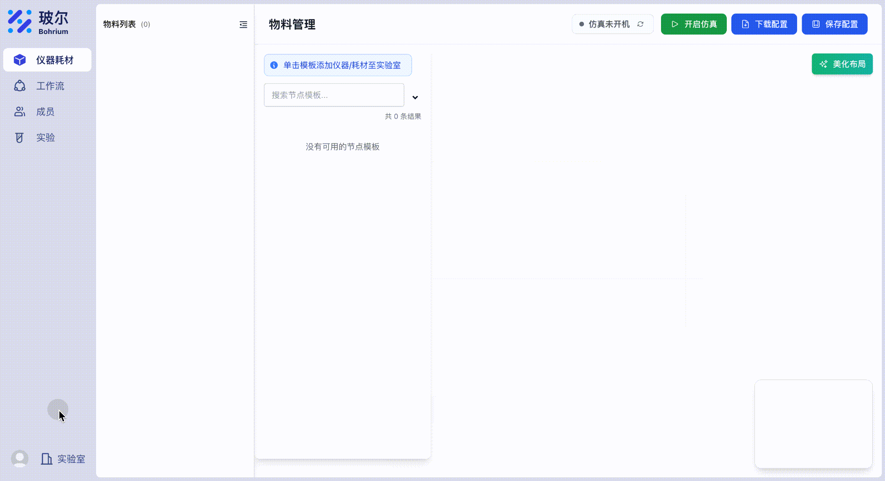

# Uni-Lab 配置指南

本文档详细介绍 Uni-Lab 配置文件的结构、配置项、命令行覆盖和环境变量的使用方法。

## 配置文件概述

Uni-Lab 使用 Python 格式的配置文件（`.py`），默认为 `unilabos_data/local_config.py`。配置文件采用类属性的方式定义各种配置项，比 YAML 或 JSON 提供更多的灵活性，包括支持注释、条件逻辑和复杂数据结构。

## 获取实验室密钥

在配置文件或启动命令中，您需要提供实验室的访问密钥（ak）和私钥（sk）。

**获取方式：**

进入 [Uni-Lab 实验室](https://leap-lab.bohrium.com)，点击左下角的头像，在实验室详情中获取所在实验室的 ak 和 sk：



## 配置文件格式

### 默认配置示例

首次使用时，系统会自动创建一个基础配置文件 `local_config.py`：

```python
# unilabos的配置文件

class BasicConfig:
    ak = ""  # 实验室网页给您提供的ak代码
    sk = ""  # 实验室网页给您提供的sk代码


# WebSocket配置，一般无需调整
class WSConfig:
    reconnect_interval = 5  # 重连间隔（秒）
    max_reconnect_attempts = 999  # 最大重连次数
    ping_interval = 30  # ping间隔（秒）
```

### 完整配置示例

您可以根据需要添加更多配置选项：

```python
#!/usr/bin/env python
# coding=utf-8
"""Uni-Lab 配置文件"""

# 基础配置
class BasicConfig:
    ak = ""  # 实验室访问密钥
    sk = ""  # 实验室私钥
    working_dir = ""  # 工作目录（通常自动设置）
    config_path = ""  # 配置文件路径（自动设置）
    is_host_mode = True  # 是否为主站模式
    slave_no_host = False  # False=必须等待 Host；True=显式离线降级并后台重连
    upload_registry = False  # 是否上传注册表
    machine_name = "undefined"  # 机器名称（自动获取）
    vis_2d_enable = False  # 是否启用2D可视化
    enable_resource_load = True  # 是否启用资源加载
    communication_protocol = "websocket"  # 通信协议
    log_level = "DEBUG"  # 日志级别：TRACE, DEBUG, INFO, WARNING, ERROR, CRITICAL

# WebSocket配置
class WSConfig:
    reconnect_interval = 5  # 重连间隔（秒）
    max_reconnect_attempts = 999  # 最大重连次数
    ping_interval = 30  # ping间隔（秒）

# HTTP配置
class HTTPConfig:
    remote_addr = "https://leap-lab.bohrium.com/api/v1"  # 远程服务器地址
    material_query_timeout = 10

# Host/Slave 网络服务（由 Edge 微后端拥有）
class HostLinkConfig:
    enable = True
    host = ""  # Slave 填 Host 微后端 IP
    port = 7302
    bind = "0.0.0.0"
    advertise_ip = ""
    ros_assist_apply = True
    ros_domain_id = ""
    ros_discovery_range = ""
    ros_static_peers = ""
    ros_discovery_server = ""

# ROS配置
class ROSConfig:
    modules = [
        "std_msgs.msg",
        "geometry_msgs.msg",
        "control_msgs.msg",
        "control_msgs.action",
        "nav2_msgs.action",
        "unilabos_msgs.msg",
        "unilabos_msgs.action",
    ]  # 需要加载的ROS模块
```

## 配置优先级

配置项的生效优先级从高到低为：

1. **命令行参数**：最高优先级
2. **环境变量**：中等优先级
3. **配置文件**：基础优先级

这意味着命令行参数会覆盖环境变量和配置文件，环境变量会覆盖配置文件。

## 推荐配置方式

根据参数特性，不同配置项有不同的推荐配置方式：

### 建议通过命令行指定的参数（不需要写入配置文件）

以下参数推荐通过命令行或环境变量指定，**一般不需要在配置文件中配置**：

| 参数              | 命令行参数          | 原因                                 |
| ----------------- | ------------------- | ------------------------------------ |
| `ak` / `sk`       | `--ak` / `--sk`     | **安全考虑**：避免敏感信息泄露       |
| `working_dir`     | `--working_dir`     | **灵活性**：不同环境可能使用不同目录 |
| `is_host_mode`    | `--is_slave`        | **运行模式**：由启动场景决定，不固定 |
| `slave_no_host`   | `--slave_no_host`   | **离线降级**：仅故障排查/隔离测试时使用 |
| `remote_addr`     | `--addr`            | **环境切换**：测试/生产环境快速切换  |

**推荐用法示例：**

```bash
# 标准启动命令（所有必要参数通过命令行指定）
unilab --ak your_ak --sk your_sk -g graph.json

# 测试环境
unilab --addr test --ak your_ak --sk your_sk -g graph.json

# 从站模式
unilab --is_slave --ak your_ak --sk your_sk

# 独立同步模板
unilab --ak your_ak --sk your_sk template-sync
```

### 适合在配置文件中配置的参数

以下参数适合在配置文件中配置，通常不会频繁更改：

| 参数                     | 配置类      | 说明                   |
| ------------------------ | ----------- | ---------------------- |
| `log_level`              | BasicConfig | 日志级别配置           |
| `reconnect_interval`     | WSConfig    | WebSocket 重连间隔     |
| `max_reconnect_attempts` | WSConfig    | WebSocket 最大重连次数 |
| `ping_interval`          | WSConfig    | WebSocket 心跳间隔     |
| `modules`                | ROSConfig   | ROS 模块列表           |

**配置文件示例（推荐最小配置）：**

```python
# unilabos的配置文件

class BasicConfig:
    log_level = "INFO"  # 生产环境建议 INFO，调试时用 DEBUG

# WebSocket配置，一般保持默认即可
class WSConfig:
    reconnect_interval = 5
    max_reconnect_attempts = 999
    ping_interval = 30
```

**注意：** `ak` 和 `sk` 不建议写在配置文件中，始终通过命令行参数或环境变量传递。

## 命令行参数覆盖配置

Uni-Lab 允许通过命令行参数覆盖配置文件中的设置，提供更灵活的配置方式。

### 支持命令行覆盖的配置项

| 配置类        | 配置字段          | 命令行参数          | 说明                             |
| ------------- | ----------------- | ------------------- | -------------------------------- |
| `BasicConfig` | `ak`              | `--ak`              | 实验室访问密钥                   |
| `BasicConfig` | `sk`              | `--sk`              | 实验室私钥                       |
| `BasicConfig` | `working_dir`     | `--working_dir`     | 工作目录路径                     |
| `BasicConfig` | `is_host_mode`    | `--is_slave`        | 主站模式（参数为从站模式，取反） |
| `BasicConfig` | `slave_no_host`   | `--slave_no_host`   | 允许从站离线启动并后台重连 Host  |
| `BasicConfig` | `action_mode`     | `--action_mode`     | 真实派发或模拟动作成功回执       |
| `HTTPConfig`  | `remote_addr`     | `--addr`            | 远程服务地址                     |

### 特殊命令行参数

除了直接覆盖配置项的参数外，还有一些特殊的命令行参数：

| 参数                | 说明                                 |
| ------------------- | ------------------------------------ |
| `--config`          | 指定配置文件路径                     |
| `--port`            | Web 服务端口（不影响配置文件）       |
| `--disable_browser` | 禁用自动打开浏览器（不影响配置文件） |
| `--visual`          | 可视化工具选择（不影响配置文件）     |
| `--action_mode`     | 选择 `real` 或 `simulate` 动作执行模式 |

### 命令行覆盖使用示例

```bash
# 通过命令行覆盖认证信息
unilab --ak "new_access_key" --sk "new_secret_key" -g graph.json

# 覆盖服务器地址
unilab --ak ak --sk sk --addr "https://custom.server.com/api/v1" -g graph.json

# 隔离测试：允许从站不等 Host 即启动
unilab --is_slave --slave_no_host --ak ak --sk sk

# 2D 可视化由部署配置中的 BasicConfig.vis_2d_enable 控制
unilab --ak "key" --sk "secret" --addr "test" -g graph.json
```

### 预设环境地址

`--addr` 参数支持以下预设值，会自动转换为对应的完整 URL：

- `test` → `https://leap-lab.test.bohrium.com/api/v1`
- `uat` → `https://leap-lab.uat.bohrium.com/api/v1`
- `local` → `http://127.0.0.1:48197/api/v1`
- 其他值 → 直接使用作为完整 URL

## 配置选项详解

### 1. BasicConfig - 基础配置

基础配置包含了系统运行的核心参数：

| 参数                     | 类型 | 默认值        | 说明                                       |
| ------------------------ | ---- | ------------- | ------------------------------------------ |
| `ak`                     | str  | `""`          | 实验室访问密钥（必需）                     |
| `sk`                     | str  | `""`          | 实验室私钥（必需）                         |
| `working_dir`            | str  | `""`          | 工作目录，通常自动设置                     |
| `config_path`            | str  | `""`          | 配置文件路径，自动设置                     |
| `is_host_mode`           | bool | `True`        | 是否为主站模式                             |
| `slave_no_host`          | bool | `False`       | 是否允许从站离线启动（HostLink 仍后台重连） |
| `upload_registry`        | bool | `False`       | 启动时是否上传注册表信息                   |
| `machine_name`           | str  | `"undefined"` | 机器名称，自动从 hostname 获取（不可配置） |
| `vis_2d_enable`          | bool | `False`       | 是否启用 2D 可视化                         |
| `enable_resource_load`   | bool | `True`        | 是否启用资源加载                           |
| `communication_protocol` | str  | `"websocket"` | 通信协议，固定为 websocket                 |
| `log_level`              | str  | `"DEBUG"`     | 日志级别                                   |

#### 日志级别选项

- `TRACE` - 追踪级别（最详细）
- `DEBUG` - 调试级别（默认）
- `INFO` - 信息级别
- `WARNING` - 警告级别
- `ERROR` - 错误级别
- `CRITICAL` - 严重错误级别（最简略）

#### 认证配置（ak / sk）

`ak` 和 `sk` 是必需的认证参数：

1. **获取方式**：在 [Uni-Lab 官网](https://leap-lab.bohrium.com) 注册实验室后获得
2. **配置方式**：
   - **命令行参数**：`--ak "your_key" --sk "your_secret"`（最高优先级，推荐）
   - **环境变量**：`UNILABOS_BASICCONFIG_AK` 和 `UNILABOS_BASICCONFIG_SK`
   - **配置文件**：在 `BasicConfig` 类中设置（不推荐，安全风险）
3. **安全注意**：请妥善保管您的密钥信息，不要提交到版本控制

**推荐做法**：

- **开发环境**：使用命令行参数或环境变量
- **生产环境**：使用环境变量
- **临时测试**：使用命令行参数

### 2. WSConfig - WebSocket 配置

WebSocket 是 Uni-Lab 的主要通信方式：

| 参数                     | 类型 | 默认值 | 说明               |
| ------------------------ | ---- | ------ | ------------------ |
| `reconnect_interval`     | int  | `5`    | 断线重连间隔（秒） |
| `max_reconnect_attempts` | int  | `999`  | 最大重连次数       |
| `ping_interval`          | int  | `30`   | 心跳检测间隔（秒） |

### 3. HTTPConfig - HTTP 配置

HTTP 客户端配置用于旧云端兼容和 OS 本地物料（Material）查询超时：

| 参数                     | 类型 | 默认值                                  | 说明                     |
| ------------------------ | ---- | --------------------------------------- | ------------------------ |
| `remote_addr`            | str  | `"https://leap-lab.bohrium.com/api/v1"` | 旧云端兼容地址           |
| `material_query_timeout` | int  | `10`                                    | OS 本地物料查询超时（秒） |

**预设环境地址**：

- 生产环境：`https://leap-lab.bohrium.com/api/v1`（默认）
- 测试环境：`https://leap-lab.test.bohrium.com/api/v1`
- UAT 环境：`https://leap-lab.uat.bohrium.com/api/v1`
- 本地环境：`http://127.0.0.1:48197/api/v1`

Host 的 HostLink 处理器使用同一个 `HTTPClient.material_query()`。OS 暴露兼容端点
`POST /api/v1/edge/material/query`，请求仍为 `uuids` / 可选 `id` +
`with_children`，响应仍为 `{"code": 0, "data": {"nodes": [...]}}`；库存内部的
模板、实例、父子关系和内容物会先转换成扁平 `ResourceDict`，现有设备调用方无需改协议。

Host 默认启动完整 Edge 调度微后端，并在统一运行目录中打开：

- `inventory.db`
- `device_state.db`
- `workflow_history.db`

因此前端直连 OS Host 时默认就能读取调度、物料实体、设备状态和工作流历史：

```bash
unilab -g graph.json

# 隔离三类本地数据库
unilab -g graph.json --working_dir /data/unilabos-runtime
```

后端权威由前端的一项连接配置直接选择 OS 或正式后端（Backend）。选择 OS 时，
OS 固定使用 `app/scheduler` 与本地库存权威（Inventory Authority）；选择正式后端
时，前端直接请求正式后端，OS 不作为查询代理。Slave 不打开 SQLite，只通过
HostLink 请求 Host 持有的本地物料服务。

### 3.1 HostLinkConfig - 微后端组网配置

HostLink 的服务端和客户端生命周期均属于 Edge 微后端，而不是 ROS Node：Host
监听全部 Slave 并维护心跳，Slave 只连接 Host；HostNode 创建后仅挂接实时资源树。
ROS domain、发现范围、静态对端与 Discovery Server 由 Host 微后端在 hello /
`ros_info` 响应中统一下发，Slave 在 `rclpy.init` 前应用。hello 同时包含启动图中
所有 `type=device` 节点的 `device_ids`；Host 以这些全网唯一 ID 识别 Slave，机器名
只作兼容回退。

HostLink 是控制面，不承载设备 Action。Host 默认启动 Fast DDS Discovery Server；
`--hostlink_addr 0.0.0.0:7302` 的数字端口会同时用于 HostLink/TCP 和发现服务/UDP，
两种传输不会冲突。Slave 使用它实际连通的 HostLink IP 替换 Host 广播地址并保留 UDP
端口，适配多网卡；HostNode 以 Super Client 参与发现。Slave 完成设备初始化后经 ROS
注册服务报送 `registry_name`，HostNode 据此主动创建匹配的 ROS `ActionClient`。只有
Action endpoint 已匹配的设备才进入 `GET /api/v1/online-devices`。

完整执行始终是 `EdgeScheduler -> JobExecutionBackend -> HostNode -> ROS Action -> Slave`
并从 ROS Action result 回收。若 ROS Action 不可发现，该 Job 失败并释放锁，不自动改走
HostLink，从而保留既有 ROS 组网语义。HostLink 的反向通用 RPC 只保留作控制面扩展，
待后续 Python-only HostLink 协议正式切换时再启用设备命令类型。

| 配置项 | 默认值 | 说明 |
|---|---:|---|
| `enable` | `True` | 是否启用 HostLink；关闭时保留旧 ROS 通路 |
| `host` | `""` | Slave 要连接的 Host 微后端 IP；Host 留空 |
| `bind` | `"0.0.0.0"` | Host 微后端监听地址 |
| `port` | `7302` | HostLink TCP 端口；默认也作为 Fast DDS UDP 发现端口 |
| `advertise_ip` | `""` | 下发给 Slave 的 Host IP；空值自动探测 |
| `ros_assist_apply` | `True` | Slave 是否应用 Host 下发的 ROS 策略 |
| `ros_domain_id` | `""` | 全网 `ROS_DOMAIN_ID`；空值继承 Host 环境 |
| `ros_discovery_range` | `""` | `SUBNET` / `LOCALHOST` / `OFF` |
| `ros_static_peers` | `""` | 分号分隔的静态 ROS 对端 |
| `ros_discovery_server` | `""` | 空=Host 自动托管；`off`=禁用；`ip:port`=外部服务 |
| `ros_discovery_port` | `0` | `0`=复用 HostLink 数字端口；非零=单独指定托管服务 UDP 端口 |

CLI 推荐用 `--hostlink_addr` 和 `--ros_domain_id` 覆盖最常用字段：

```bash
# Host：TCP/UDP 都使用数字端口 7302，并把 domain 42 下发给所有 Slave
unilab -g host.json --hostlink_addr 0.0.0.0:7302 --ros_domain_id 42

# Slave：仅连接 Host 微后端；不持有任何 Host SQLite
unilab --is_slave -g slave.json --hostlink_addr 192.168.1.10:7302

# 可选：HostLink/TCP 7302，Fast DDS/UDP 11811
unilab -g host.json --hostlink_addr 0.0.0.0:7302 --ros_discovery_port 11811

# 可选：改用外部发现服务，或完全关闭托管发现
unilab -g host.json --ros_discovery_server 192.168.1.20:11811
unilab -g host.json --ros_discovery_server off
```

普通 Slave 会在初始化 ROS 前持续等待 HostLink 握手成功，以确保全网使用 Host 下发的
同一 ROS 配置。`--slave_no_host` 是显式离线降级开关：它跳过首次 Host 等待和旧 ROS
注册，按本地 ROS 配置启动，但 HostLink 连接管理器仍在后台重连。它不应作为生产
Host + 多 Slave 拓扑的常规参数。无论是否使用该开关，Slave 启动图都必须至少包含
一个 `type=device` 节点；空图仅允许 Host 使用，测试请加载虚拟或 mock 设备。

### 4. ROSConfig - ROS 配置

配置 ROS 消息转换器需要加载的模块：

| 配置项    | 类型 | 默认值     | 说明         |
| --------- | ---- | ---------- | ------------ |
| `modules` | list | 见下方示例 | ROS 模块列表 |

**默认模块列表：**

```python
class ROSConfig:
    modules = [
        "std_msgs.msg",           # 标准消息类型
        "geometry_msgs.msg",      # 几何消息类型
        "control_msgs.msg",       # 控制消息类型
        "control_msgs.action",    # 控制动作类型
        "nav2_msgs.action",       # 导航动作类型
        "unilabos_msgs.msg",      # UniLab 自定义消息类型
        "unilabos_msgs.action",   # UniLab 自定义动作类型
    ]
```

您可以根据实际使用的设备和功能添加其他 ROS 模块。

## 环境变量配置

Uni-Lab 支持通过环境变量覆盖配置文件中的设置。

### 环境变量命名规则

```
UNILABOS_<配置类名>_<配置项名>
```

**注意：**

- 环境变量名不区分大小写
- 配置类名和配置项名都会转换为大写进行匹配

### 设置环境变量

#### Linux / macOS

```bash
# 临时设置（当前终端）
export UNILABOS_BASICCONFIG_LOG_LEVEL=INFO
export UNILABOS_BASICCONFIG_AK="your_access_key"
export UNILABOS_BASICCONFIG_SK="your_secret_key"

# 永久设置（添加到 ~/.bashrc 或 ~/.zshrc）
echo 'export UNILABOS_BASICCONFIG_LOG_LEVEL=INFO' >> ~/.bashrc
source ~/.bashrc
```

#### Windows (cmd)

```cmd
# 临时设置
set UNILABOS_BASICCONFIG_LOG_LEVEL=INFO
set UNILABOS_BASICCONFIG_AK=your_access_key

# 永久设置（系统环境变量）
setx UNILABOS_BASICCONFIG_LOG_LEVEL INFO
```

#### Windows (PowerShell)

```powershell
# 临时设置
$env:UNILABOS_BASICCONFIG_LOG_LEVEL="INFO"
$env:UNILABOS_BASICCONFIG_AK="your_access_key"

# 永久设置
[Environment]::SetEnvironmentVariable("UNILABOS_BASICCONFIG_LOG_LEVEL", "INFO", "User")
```

### 环境变量类型转换

系统会根据配置项的原始类型自动转换环境变量值：

| 原始类型 | 转换规则                                |
| -------- | --------------------------------------- |
| `bool`   | "true", "1", "yes" → True；其他 → False |
| `int`    | 转换为整数                              |
| `float`  | 转换为浮点数                            |
| `str`    | 直接使用字符串值                        |

**示例：**

```bash
# 布尔值
export UNILABOS_BASICCONFIG_IS_HOST_MODE=true  # 将设置为 True
export UNILABOS_BASICCONFIG_IS_HOST_MODE=false  # 将设置为 False

# 整数
export UNILABOS_WSCONFIG_RECONNECT_INTERVAL=10  # 将设置为 10

# 字符串
export UNILABOS_BASICCONFIG_LOG_LEVEL=INFO  # 将设置为 "INFO"
```

### 环境变量示例

```bash
# 设置基础配置
export UNILABOS_BASICCONFIG_AK="your_access_key"
export UNILABOS_BASICCONFIG_SK="your_secret_key"
export UNILABOS_BASICCONFIG_IS_HOST_MODE="true"

# 设置WebSocket配置
export UNILABOS_WSCONFIG_RECONNECT_INTERVAL="10"
export UNILABOS_WSCONFIG_MAX_RECONNECT_ATTEMPTS="500"

# 设置HTTP配置
export UNILABOS_HTTPCONFIG_REMOTE_ADDR="https://leap-lab.test.bohrium.com/api/v1"
```

## 配置文件使用方法

### 1. 使用默认配置文件（推荐）

系统会自动查找并加载配置文件：

```bash
# 直接启动，使用默认的 unilabos_data/local_config.py
unilab --ak your_ak --sk your_sk -g graph.json
```

查找顺序：

1. 环境变量 `UNILABOS_BASICCONFIG_CONFIG_PATH` 指定的路径
2. 工作目录下的 `local_config.py`
3. 首次使用时会引导创建配置文件

### 2. 指定配置文件启动

```bash
# 使用指定配置文件启动
unilab --config /path/to/your/config.py --ak ak --sk sk -g graph.json
```

### 3. 配置文件验证

系统启动时会自动验证配置文件：

- **语法检查**：确保 Python 语法正确
- **类型检查**：验证配置项类型是否匹配
- **加载确认**：控制台输出加载成功信息

## 常用配置场景

### 场景 1：调整日志级别

**配置文件方式：**

```python
class BasicConfig:
    log_level = "INFO"  # 生产环境建议使用 INFO 或 WARNING
```

**环境变量方式：**

```bash
export UNILABOS_BASICCONFIG_LOG_LEVEL=INFO
unilab --ak ak --sk sk -g graph.json
```

**命令行方式**（需要配置文件已包含）：

```bash
# 配置文件无直接命令行参数，需通过环境变量
UNILABOS_BASICCONFIG_LOG_LEVEL=INFO unilab --ak ak --sk sk -g graph.json
```

### 场景 2：配置 WebSocket 重连

**配置文件方式：**

```python
class WSConfig:
    reconnect_interval = 10  # 增加重连间隔到 10 秒
    max_reconnect_attempts = 100  # 减少最大重连次数到 100 次
```

**环境变量方式：**

```bash
export UNILABOS_WSCONFIG_RECONNECT_INTERVAL=10
export UNILABOS_WSCONFIG_MAX_RECONNECT_ATTEMPTS=100
```

### 场景 3：切换服务器环境

**配置文件方式：**

```python
class HTTPConfig:
    remote_addr = "https://leap-lab.test.bohrium.com/api/v1"
```

**环境变量方式：**

```bash
export UNILABOS_HTTPCONFIG_REMOTE_ADDR=https://leap-lab.test.bohrium.com/api/v1
```

**命令行方式（推荐）：**

```bash
unilab --addr test --ak your_ak --sk your_sk -g graph.json
```

### 场景 4：从站模式配置

**配置文件方式：**

```python
class BasicConfig:
    is_host_mode = False  # 从站模式
    slave_no_host = False  # 生产模式必须等待 Host
```

**命令行方式（推荐）：**

```bash
unilab --is_slave --hostlink_addr 192.168.1.10:7302 --ak your_ak --sk your_sk
```

只有需要在 Host 不可用时单机排查 Slave，才额外传入 `--slave_no_host`。

## 最佳实践

### 1. 安全配置

**不要在配置文件中存储敏感信息**

- ❌ **不推荐**：在配置文件中明文存储 ak/sk
- ✅ **推荐**：使用环境变量或命令行参数

```bash
# 生产环境 - 使用环境变量（推荐）
export UNILABOS_BASICCONFIG_AK="your_access_key"
export UNILABOS_BASICCONFIG_SK="your_secret_key"
unilab -g graph.json

# 或使用命令行参数
unilab --ak "your_access_key" --sk "your_secret_key" -g graph.json
```

**其他安全建议：**

- 不要将包含密钥的配置文件提交到版本控制系统
- 限制配置文件权限：`chmod 600 local_config.py`
- 定期更换访问密钥
- 使用 `.gitignore` 排除配置文件

### 2. 多环境配置

为不同环境创建不同的配置文件：

```
configs/
├── base_config.py       # 基础配置（非敏感）
├── dev_config.py        # 开发环境
├── test_config.py       # 测试环境
├── prod_config.py       # 生产环境
└── example_config.py    # 示例配置
```

**环境切换示例**：

```bash
# 本地开发环境
unilab --config configs/dev_config.py --addr local --ak ak --sk sk -g graph.json

# 测试环境
unilab --config configs/test_config.py --addr test --ak ak --sk sk -g graph.json

# 生产环境
unilab --config configs/prod_config.py --ak "$PROD_AK" --sk "$PROD_SK" -g graph.json
```

### 3. 配置管理

**配置文件最佳实践：**

- 保持配置文件简洁，只包含需要修改的配置项
- 为配置项添加注释说明其作用
- 定期检查和更新配置文件
- 版本控制仅保存示例配置，不包含实际密钥

**命令行参数优先使用场景：**

- 临时测试不同配置
- CI/CD 流水线中的动态配置
- 不同环境间快速切换
- 敏感信息的安全传递

### 4. 灵活配置策略

**基础配置文件 + 命令行覆盖**的推荐方式：

```python
# base_config.py - 基础配置（非敏感信息）
class BasicConfig:
    # 非敏感配置写在文件中
    is_host_mode = True
    upload_registry = False
    vis_2d_enable = False
    log_level = "INFO"

class WSConfig:
    reconnect_interval = 5
    max_reconnect_attempts = 999
    ping_interval = 30
```

```bash
# 启动时通过命令行覆盖关键参数
unilab --config base_config.py \
       --ak "$AK" \
       --sk "$SK" \
       --addr "test" \
       -g graph.json
```

## 故障排除

### 1. 配置文件加载失败

**错误信息**：`[ENV] 配置文件 xxx 不存在`

**解决方法**：

- 确认配置文件路径正确
- 检查文件权限是否可读
- 确保配置文件是 `.py` 格式
- 使用绝对路径或相对于当前目录的路径

### 2. 语法错误

**错误信息**：`[ENV] 加载配置文件 xxx 失败`

**解决方法**：

- 检查 Python 语法是否正确
- 确认类名和字段名拼写正确
- 验证缩进是否正确（使用空格而非制表符）
- 确保字符串使用引号包裹

### 3. 认证失败

**错误信息**：`后续运行必须拥有一个实验室`

**解决方法**：

- 确认 `ak` 和 `sk` 已正确配置
- 检查密钥是否有效（未过期或撤销）
- 确认网络连接正常
- 验证密钥是否来自正确的实验室

### 4. 环境变量不生效

**解决方法**：

- 确认环境变量名格式正确（`UNILABOS_<类名>_<字段名>`）
- 检查环境变量是否已正确设置（`echo $VARIABLE_NAME`）
- 重启终端或重新加载环境变量
- 确认环境变量值的类型正确

### 5. 命令行参数不生效

**错误现象**：设置了命令行参数但配置没有生效

**解决方法**：

- 确认参数名拼写正确（如 `--ak` 而不是 `--access_key`）
- 检查参数格式是否正确（布尔参数如 `--is_slave` 不需要值）
- 确认参数位置正确（所有参数都应在 `unilab` 之后）
- 查看启动日志确认参数是否被正确解析
- 检查是否有配置文件或环境变量与之冲突

### 6. 配置优先级混淆

**错误现象**：不确定哪个配置生效

**解决方法**：

- 记住优先级：**命令行参数 > 环境变量 > 配置文件**
- 使用 `--ak` 和 `--sk` 参数时会看到提示信息："传入了 ak 参数，优先采用传入参数！"
- 检查启动日志中的配置加载信息
- 临时移除低优先级配置来测试高优先级配置是否生效
- 使用 `printenv | grep UNILABOS` 查看所有相关环境变量

## 配置验证

### 检查配置是否生效

启动 Uni-Lab 时，控制台会输出配置加载信息：

```
[ENV] 配置文件 /path/to/config.py 加载成功
[ENV] 设置 BasicConfig.log_level = INFO
传入了ak参数，优先采用传入参数！
传入了sk参数，优先采用传入参数！
```

### 常见配置错误

1. **配置文件格式错误**

   ```
   [ENV] 加载配置文件 /path/to/config.py 失败
   ```

   **解决方案**：检查 Python 语法，确保配置类定义正确

2. **环境变量格式错误**

   ```
   [ENV] 环境变量格式不正确：UNILABOS_INVALID_VAR
   ```

   **解决方案**：确保环境变量遵循 `UNILABOS_<类名>_<字段名>` 格式

3. **类或字段不存在**
   ```
   [ENV] 未找到类：UNKNOWNCONFIG
   [ENV] 类 BasicConfig 中未找到字段：UNKNOWN_FIELD
   ```
   **解决方案**：检查配置类名和字段名是否正确

## OpenTelemetry / SigNoz 追踪与日志

Edge 观测默认关闭；没有显式配置时不会加载 OpenTelemetry SDK，也不会发起网络请求。启用后，trace 与 Python `logging` 使用同一 OTLP/gRPC collector 和资源属性：

```bash
export UNILABOS_OTEL_ENABLED=true
export OTEL_SERVICE_NAME=uni-lab-edge
export OTEL_EXPORTER_OTLP_TRACES_ENDPOINT=http://signoz-otel-collector:4317
export OTEL_EXPORTER_OTLP_LOGS_ENDPOINT=http://signoz-otel-collector:4317
export OTEL_EXPORTER_OTLP_INSECURE=true
export OTEL_DEPLOYMENT_ENVIRONMENT=production
export OTEL_TRACES_SAMPLER=parentbased_traceidratio
export OTEL_TRACES_SAMPLER_ARG=0.25
unilab ...
```

本地开发通过 Docker Desktop 中的 SigNoz 接入时，将 endpoint 指向宿主机发布的
OTLP/HTTP collector，并显式选择协议：

```bash
export OTEL_EXPORTER_OTLP_ENDPOINT=http://127.0.0.1:4318
export OTEL_EXPORTER_OTLP_PROTOCOL=http/protobuf
export OTEL_EXPORTER_OTLP_INSECURE=true
```

SigNoz 管理界面位于 `http://localhost:8080`，OTLP/gRPC 和 OTLP/HTTP 分别监听
`localhost:4317` 与 `localhost:4318`。Electron 一键启动 Edge 时会自动注入以上
OTLP/HTTP 配置。

需要认证 header 时使用运行环境的 secret 注入 `OTEL_EXPORTER_OTLP_HEADERS`，不要写入配置文件、日志或版本控制。也可在 `local_config.py` 的 `OTelConfig` 中配置 `enabled`、`endpoint`、`logs_enabled`、`logs_endpoint`、`service_name`、采样率和批处理参数；环境变量优先。设置 `UNILABOS_OTEL_LOGS_ENABLED=false` 或 `OTEL_LOGS_EXPORTER=none` 可只保留 traces。

trace 与日志实现都使用异步批量导出和有界队列。collector 不可用、SDK 缺失、队列溢出或关闭 flush 超时均 fail-open，不阻断调度和仪器控制。OTLP exporter 自身及 gRPC 内部日志不会重新进入日志 exporter，避免递归。默认批处理参数是：

- `max_queue_size = 2048`
- `max_export_batch_size = 512`
- `schedule_delay_ms = 5000`
- `export_timeout_ms = 5000`
- `shutdown_timeout_ms = 5000`

链路使用 W3C `traceparent` / `tracestate` 穿过 HTTP、WebSocket、HostLink、线程队列和 inventory outbox；`trace_id` / `span_id` 只用于日志、ledger、SSE 和云端记录关联。追踪属性只记录 workflow、job、device、action、material 等标识和状态，不记录完整配方、动作参数、认证 token 或原始 payload。主要层级为：

```text
HTTP 路由模板 server span / ws.receive
└── workflow.task.run
    ├── workflow.task.submit / workflow.task.reconcile / workflow.job.dispatch
    ├── material.* → inventory.ledger.append → inventory.outbox.publish
    └── action.run
        ├── action.queue → action.worker
        ├── action.execute
        │   └── action.retry / action.skipped / action.operator_intervention
        └── action.status.publish
```

启用观测后，现有文本日志会自动附加 `trace_id` 和 `span_id`，同时作为 OTLP LogRecord 写入 SigNoz，可按 `service.name=uni-lab-edge` 关联检索。
Electron 直连 Edge 时，REST 与 SSE 使用 W3C `traceparent` 请求头，设备状态 WebSocket
握手使用同名查询参数；CORS 已放行 `traceparent`/`tracestate`。Edge server span 会
继承该远程上下文，因此可以在 SigNoz 中按同一个 Trace ID 查看请求与后续调度链路。

## 相关文档

- [工作目录详解](working_directory.md)
- [启动参数详解](../user_guide/launch.md)
- [快速安装指南](../user_guide/quick_install_guide.md)
