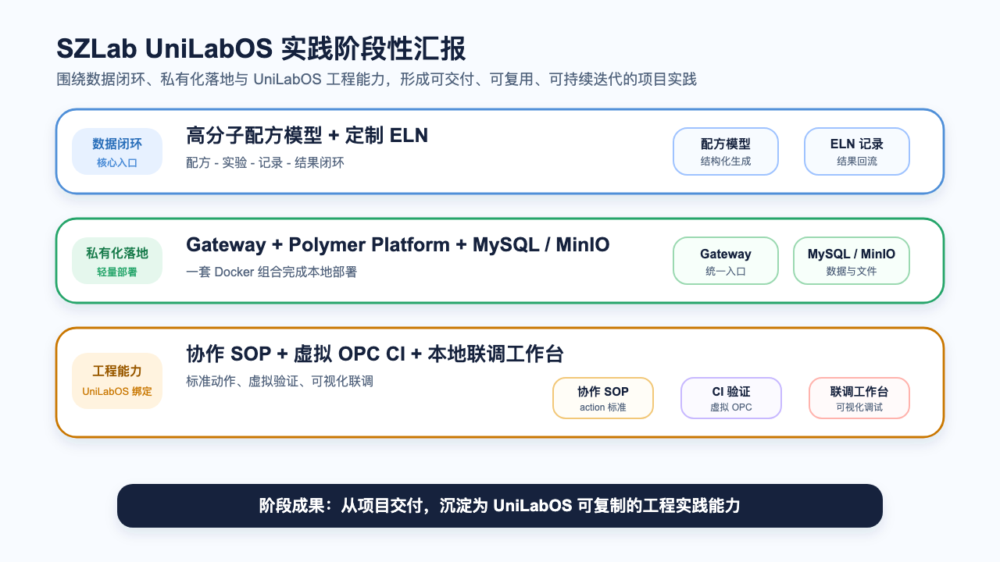
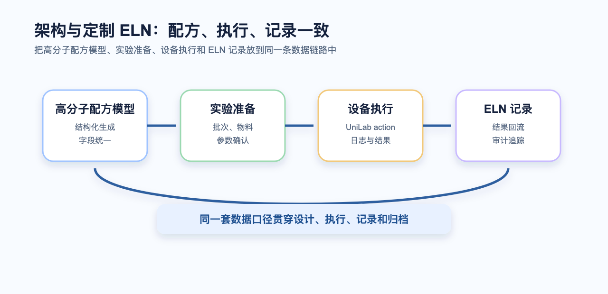
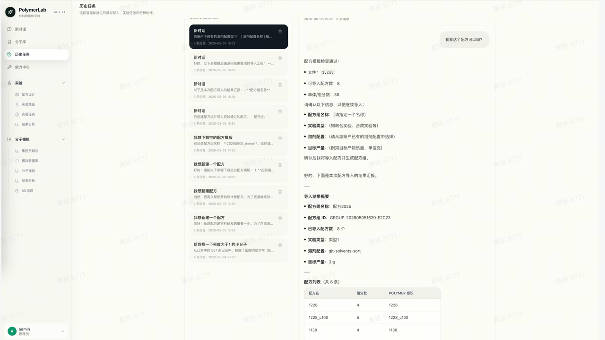
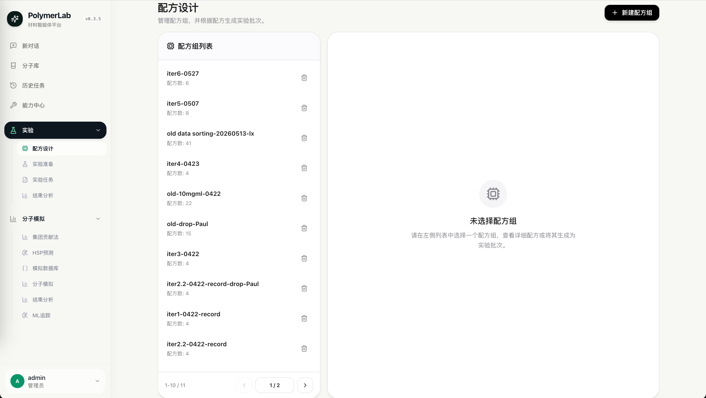
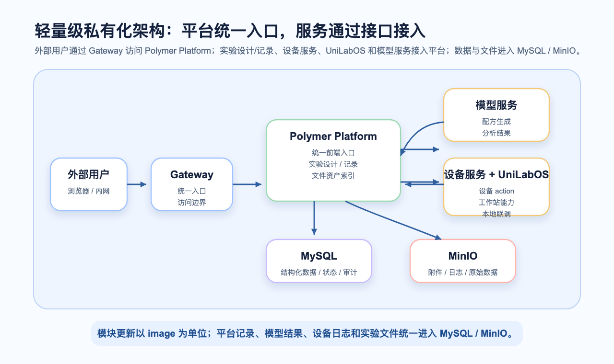
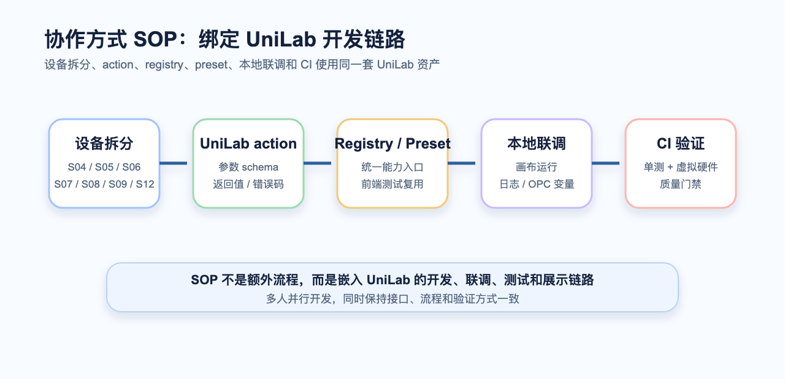
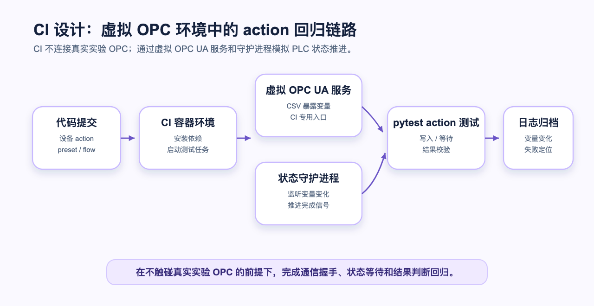
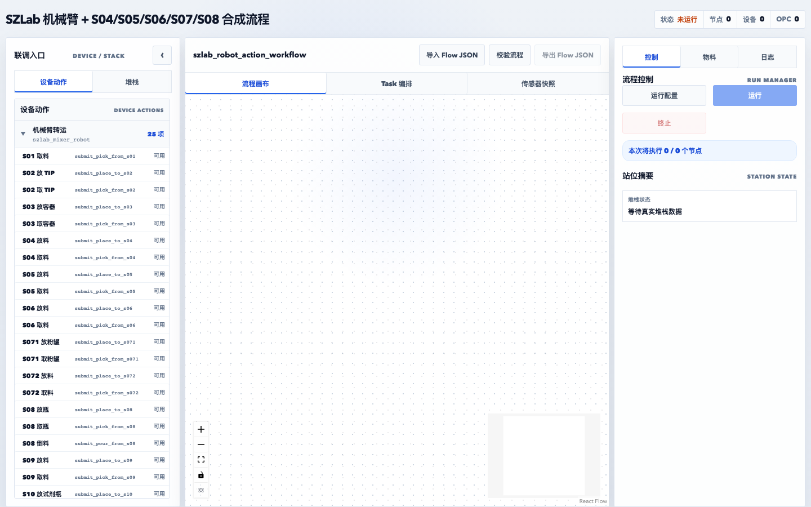
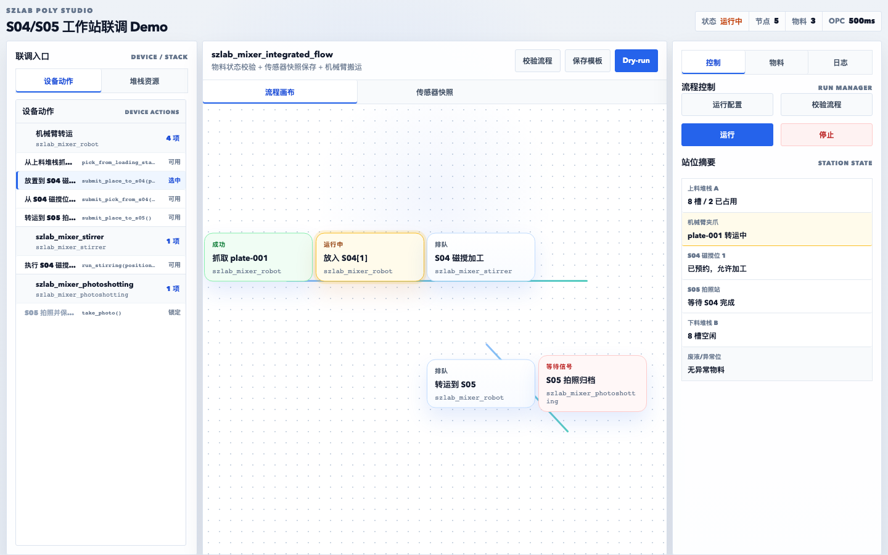

# SZLab UniLabOS 实践阶段性汇报

## 一句话结论

SZLab 项目已经从“单设备接入”推进到“UniLabOS 工程实践和平台化交付雏形”：上层形成高分子配方模型与定制 ELN 的记录闭环，中间具备轻量级私有化部署方案，底层沉淀了与 UniLabOS 深度绑定的设备协作 SOP、CI 验证链路和本地联调工作台。这个项目不仅服务 SZLab 现场交付，也在反向沉淀 UniLabOS 的设备接入、工作站联调、质量验证和私有化部署实践。

## 1. 架构与定制 ELN：打通配方、实验和记录

背景：客户当前缺少统一的电子实验记录本，配方、实验条件、结果数据分散在纸质报告和多台电脑的 Excel 文件中。自动化实验要真正产生价值，第一步不是直接上设备，而是先建立标准化的数据入口：配方怎么定义、实验怎么准备、结果怎么记录、附件怎么归档、后续怎么追溯。只有把这些基础数据先规范起来，设备执行结果才能被稳定接收，后续分析、复盘和模型迭代才有统一口径。

SZLab 的架构重点是把高分子配方模型、实验准备、设备执行、实验记录、附件归档和结果回流放到同一条数据链路中，避免配方设计、执行过程和实验记录各自割裂。Polymer Platform 保留 Agent 入口，后续可以继续扩展面向具体实验场景的 skill；当前已经支持部分配方模型相关能力，包括配方导出、实验结果导入等。

核心价值：

- **配方和实验记录一致**：高分子配方模型生成的配方可以作为实验准备和执行记录的来源，减少手工转录和口径不一致。
- **适合项目定制**：实验类型、配方字段、导出模板、结果记录可以围绕 SZLab 项目定制，而不是套用通用 ELN。
- **数据可追溯**：配方、实验批次、实验记录、附件和审计事件形成闭环，便于后续复盘、分析和质量追踪。
- **为设备执行预留接口**：设备日志、照片、原始数据和结果文件后续可统一挂接到实验记录上，而不是散落在本地文件夹。
- **保留 Agent 扩展入口**：通过 Agent 入口承接配方模型 skill、导出、导入实验结果等能力，后续可以继续扩展到更多实验助手和自动化流程。

> 这不是“记录系统”和“设备系统”两套东西，而是把研发配方、实验执行和实验记录统一到一个项目级闭环里。

## 2. 轻量级私有化：一台服务器即可落地

背景：客户明确要求私有化部署，设备进场后通常处于内网环境，无法稳定连接外网；同时，现场交付需要快速拉起一套可用系统，方便项目成员、客户和初学者直接进入真实流程。轻量化本地部署可以降低环境准备成本，也让后续版本升级、现场验证和客户定制更可控。

SZLab 现场私有化部署需要兼顾权限、网络和交付效率。线上跃迁实验室与云端平台的绑定在统一鉴权、统一资源管理上有优势，但在客户私有环境里会遇到外网不可达、账号体系不一致、部署链路偏重等问题。因此本项目保留平台化接口和数据治理方式，同时采用更轻量的本地部署方案，便于客户快速上手、现场独立运行和后续定制化交付。

私有化部署采用单机 Docker Compose 方案。外部用户通过 Gateway 进入 Polymer Platform；Polymer Platform 作为统一前端入口，后台的实验设计/记录、设备服务、UniLabOS 和模型服务都通过接口接入平台；MySQL 和 MinIO 作为底层数据与文件服务，平台记录的数据、附件、设备日志、模型结果和实验文件统一进入 MySQL / MinIO。

核心组件：

- **Gateway**：对外统一入口，收敛访问边界。
- **Polymer Platform**：统一前端入口，承载配方、实验、用户、审计、文件资产索引，并通过 API 接入实验设计/记录、设备服务、UniLabOS 和模型服务。
- **MySQL**：承载结构化业务数据、状态、审计和文件索引。
- **MinIO**：承载实验附件、设备日志、照片、原始数据和导出包。
- **设备服务 + UniLabOS**：承载设备 action、本地联调和工作站能力，产出的文件与数据回到 MySQL / MinIO。
- **模型服务**：以接口方式接入 Polymer Platform，配方生成、分析结果和相关文件同样进入平台的数据与文件治理链路。

核心价值：

- **部署轻**：Docker 一键启动，降低项目现场部署和迁移成本。
- **更新简单**：不同模块可以通过替换对应 image 完成版本更新，减少现场升级成本。
- **边界清晰**：结构化数据进 MySQL，文件和原始数据进 MinIO，业务系统只引用文件资产。
- **运维可控**：服务健康检查、日志查看、备份恢复都可以标准化。
- **适合私有环境**：不依赖复杂云服务，便于进入内网、实验室服务器或客户私有环境。

## 3. 协作方式 SOP：和 UniLab 深度绑定的设备开发模式

背景：SZLab 项目设备多、工位多、接口多，是一个适合让更多同学参与学习和实践的项目。但多人协作如果没有统一开发方式，很容易出现设备接口风格不一致、preset 重复维护、测试缺失和联调成本上升等问题。因此我们借这个项目探索一套多人合作开发模式，把设备接入、action 定义、preset、测试、前端联调和 CI 放到同一条标准流程里。

SZLab 的复杂度来自多设备、多工位、多人员协同。如果每个人按自己的方式接设备，后期很难维护。因此当前协作 SOP 的重点不是写文档约束大家，而是把协作方式绑定到 UniLabOS 的设备模型、action、registry、preset、测试和本地联调工具中。SZLab 的每个设备能力都以 UniLabOS action 形式沉淀，上层流程、测试用例和调试界面都围绕同一套 action 复用；同时，项目中暴露出的设备建模、参数约定、日志结构和测试需求，也会反向推动 UniLabOS 的工程规范完善。

标准协作链路：

1. **按设备拆分任务**：S04、S05、S06、S07、S08、S09、S12 机械臂等分别沉淀设备能力。
2. **用 UniLabOS action 表达能力**：每个设备对外暴露稳定 action，参数和返回值可被上层流程复用。
3. **通过 registry / preset 统一入口**：前端和测试不手写设备清单，而是读取 UniLabOS 设备定义和 preset。
4. **用本地工作台联调**：开发者可以在画布中组合 action、运行、查看日志、定位 OPC 变量变化。
5. **进入 CI 验证**：核心 action 通过单测和虚拟 OPC UA 集成验证，在不连接真实实验 OPC 环境的情况下完成回归。

核心价值：

- **并行开发**：同一项目可按设备拆分，多人同时推进。
- **接口一致**：设备能力以 UniLabOS action 形式沉淀，上层流程不关心具体实现细节。
- **复用性强**：设备 action 稳定后，可以被不同 recipe、测试 preset 和工作站流程复用。
- **减少返工**：CI 和本地联调提前发现参数、握手、变量名和状态等待问题。
- **沉淀 UniLabOS 实践规范**：SZLab 作为真实复杂工作站项目，可以把设备建模、调试工具、CI 模板和多人协作方式沉淀回 UniLabOS。

> SOP 不是额外流程，而是嵌入 UniLabOS 的开发链路。开发、联调、测试、前端展示都围绕同一套设备 action 运转。

## 4. CI 设计：用虚拟 OPC 环境验证 action 链路

背景：项目推进过程中已经暴露出一些兼容性问题，例如不同开发环境下依赖差异、设备 action 写法不统一、变量握手逻辑容易漏测、代码提交后缺少标准化交付验证等。仅靠人工联调很难覆盖这些问题，也不适合把每次回归都放到真实设备或真实实验 OPC 环境中执行。因此需要一套标准化 CI，把编码规范、单元测试、虚拟 OPC 回归和日志输出固化下来。

当前 CI 的价值不只是跑 Python 单测，而是把设备开发中最容易出问题的 OPC UA 通信、PLC 变量握手和 action 执行过程放进自动化验证中。CI 链路不连接真实实验 OPC 环境，完全通过虚拟 OPC UA 服务和守护进程模拟 PLC 状态推进，从而避免 CI 对现场设备和真实实验网络产生依赖。

CI 中的关键角色：

- **OPC UA 虚拟服务进程**：根据 CSV 暴露虚拟 PLC 变量，提供 CI 专用通信入口。
- **状态守护进程**：根据 flow 规则监听变量变化，模拟 PLC 或设备的状态推进。
- **设备 action 测试进程**：运行 pytest，调用真实设备 action，检查写入、等待、完成信号和异常处理。

当前仓库已有的 CI 链路包括：

- 容器化运行环境，减少开发机差异。
- flake8 和全量 pytest。
- SZLab 专项测试。
- OPC UA 集成 manifest，统一启动虚拟服务、守护进程和 action 测试。
- 运行结束后输出虚拟服务和守护进程日志，便于定位失败原因。

核心价值：

- **隔离真实实验环境**：CI 不连接真实实验 OPC，不影响现场设备、真实 PLC 和实验网络。
- **提升回归信心**：设备 action 改动后，可以验证是否破坏既有流程。
- **降低协作成本**：不同设备负责人提交代码时，都进入同一套质量门禁。
- **利于问题定位**：CI 日志保留变量变化和流程摘要，方便开发者快速判断是 action、变量名还是状态规则问题。

> 我们把设备 action 的通信握手、状态等待和结果判断放入虚拟 OPC 环境中回归，避免 CI 依赖真实实验 OPC。

## 5. 本地联调工作台：让复杂设备流程可看、可跑、可定位

背景：设备现场调试时，接口报错、OPC 等待、参数写入、节点执行状态经常分散在终端日志、JSON、CSV 和前端页面之间；网络环境不稳定或设备状态复杂时，问题定位成本更高。需要一个本地工作台把流程、节点状态、接口错误、OPC 变量变化和物料/站位状态聚合起来，方便开发者现场调试、纠错和复盘。

SZLab 本地前端把设备 action、流程画布、运行控制、日志、OPC 变量变化和堆栈/物料状态集中到一个界面里，用于设备开发、流程联调和问题排查。

> 说明：第一张为当前 `szlab_robot_action_workflow` preset 的真实前端截图；第二张为带节点、站位摘要和运行状态的前端 demo 截图，适合在飞书文档中展示交互形态。

已体现出的能力：

- **流程画布**：通过 React Flow 组合设备 action，形成可视化流程。
- **起点续跑**：可从指定节点开始运行，适合现场调试和失败后重试。
- **节点禁用**：可跳过某个节点及其后续影响范围，用于局部验证。
- **参数编辑**：双击节点编辑 action 参数，减少改 JSON 的成本。
- **日志分类**：按流程、节点、OPC 采样、OPC 等待、结果和错误分类查看。
- **OPC 变量变化表**：展示变量的 begin / goal / end，有助于判断动作是否真正写入并完成。
- **堆栈和站位摘要**：把物料位置、槽位占用和站位状态放到同一界面中。

核心价值：

- **调试效率高**：开发者不需要在多个日志、CSV、JSON 和终端之间来回切换。
- **问题更容易定位**：失败可以对应到具体节点、具体 OPC 变量和具体等待条件。
- **适合 AI 辅助排错**：结构化日志、节点 ID、变量变化和 action 参数可以直接作为上下文输入，辅助定位问题。
- **降低现场联调风险**：先在本地工作台验证局部流程，再上真实设备执行。

> 本地工作台把复杂设备流程从“黑盒执行”变成“可视化、可续跑、可定位”的工程工具。

## 阶段性价值总结

| 方向 | 阶段成果 | 对项目的价值 |
| --- | --- | --- |
| 架构与 ELN | 配方、实验、记录和文件资产闭环设计 | 统一研发数据口径 |
| 私有化部署 | Gateway + Polymer Platform + MySQL + MinIO + 设备服务 / UniLabOS / 模型服务 | 快速落地、低运维成本、方便按 image 更新 |
| 协作 SOP | 设备 action、registry、preset、CI 绑定 | 多人并行开发且保持一致 |
| CI 验证 | 虚拟 OPC UA + 守护进程 + action 测试 | 提前发现设备联调问题 |
| 本地工作台 | 画布、日志、OPC 变量、续跑和禁用 | 提升调试效率和问题定位能力 |

## 下一阶段计划

1. **冻结 SZLab 设备 action 合同**：明确每个设备 action 的参数、返回值、错误码和关键 OPC 变量。
2. **补齐 SOP 文档模板**：每个设备统一包含能力清单、调试 preset、CI 用例和常见问题。
3. **打通 ELN 与设备结果**：优先把照片、日志和关键结果文件挂接到实验记录。
4. **完善私有化部署包**：形成 `.env.example`、启动脚本、健康检查和备份说明。
5. **沉淀汇报演示数据**：准备一个可稳定复现的端到端 demo，用于后续飞书文档和现场展示。
