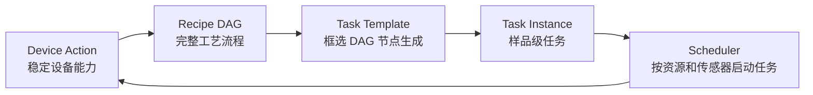
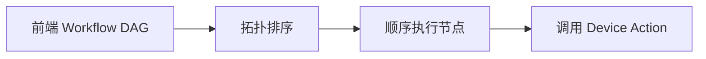
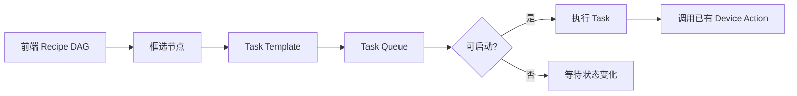
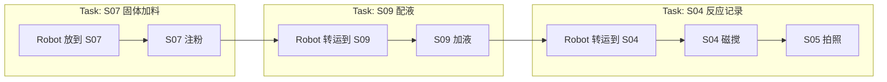
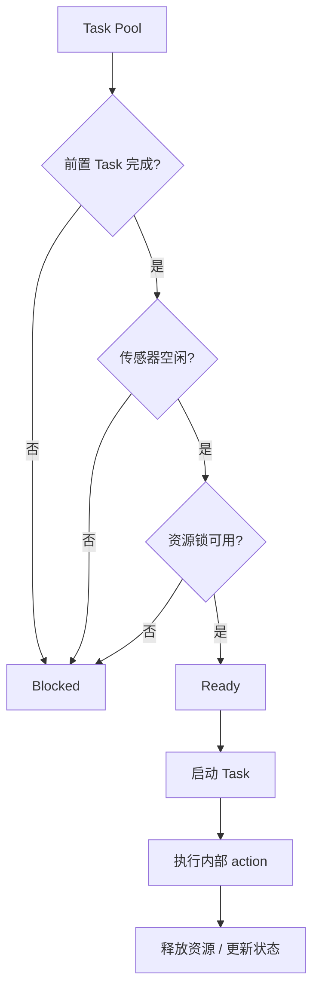
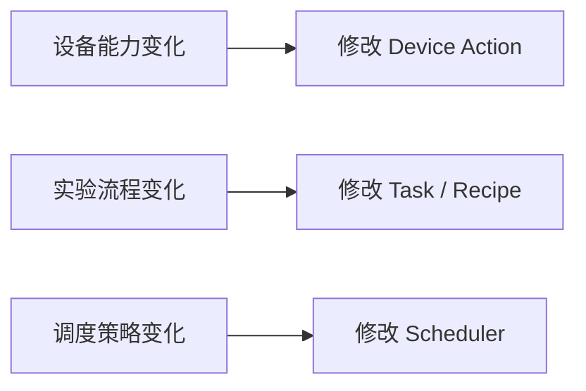

# SZLab Task 编排能力讨论稿

## 背景

SZLab Poly Studio 已接入多个设备 action，包括机械臂转运、S07 固体加料、S08 开关盖、S09 移液、S04 磁搅、S05 拍照等。单个 action 已具备调试基础，下一步问题集中在多样品、多设备、多工位协作时的任务编排和资源调度。

线性 workflow 对单样品调试直观，但在高通量场景中容易让机械臂或工位等待。例如 S07 注粉期间，机械臂已经空闲，理论上可以继续给 S08/S09 放瓶，或准备下一个样品。为避免把这些调度逻辑写死在 action 或线性 DAG 中，需要在现有 workflow 与 device action 之间增加 Task 编排层。

## 核心方案



分层含义：

- **Device Action**：设备能力层，接入完成后尽量稳定。
- **Recipe DAG**：前端仍用 DAG 表达完整工艺流程，负责“人能看懂的 recipe”。
- **Task Template**：从 DAG 中框选一段节点，形成可调度的工艺任务。
- **Task Instance**：每个样品基于 Task Template 生成具体任务实例。
- **Scheduler**：根据前置关系、传感器状态、资源锁选择可启动任务。

## 当前模式与目标模式

当前更接近顺序执行：



目标是引入 Task 调度：



## 前端交互示意

一个线性 DAG 可以被切成多个 Task：



## 调度判断

第一版 Scheduler 不需要复杂优化算法，先完成基础可启动判断：



第一版判断条件：

```text
can_start(task) =
  前置 task 已完成
  && 目标传感器空闲
  && robot / 工站 / 槽位资源未被占用
```

后续可扩展：

- 优先级。
- 等待时间。
- 瓶颈设备权重。
- 高通量设备填槽策略。
- 机械臂路径优化。
- 多机械臂调度。

## 边界划分



原则：

- Device Action 不绑定具体 recipe。
- Recipe DAG 负责表达完整工艺。
- Task 负责将一段工艺变成可调度单元。
- Scheduler 负责运行时资源协调。

## 本次会议目标

需要优先确认以下方向：

1. 是否认可 `Device Action -> Recipe DAG -> Task -> Scheduler` 的分层。
2. Unilab 本身是否其实已经具备了类似功能，或者计划做类似的功能